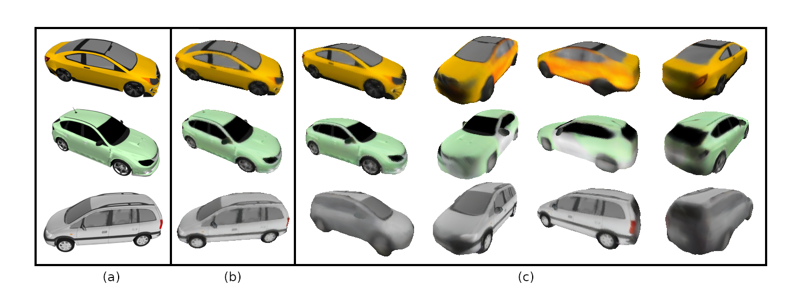

# MFPRN
monocular feature projection & object reconstruction network

# 3D Reconstruction from a Single RGB Image



# 3D Reconstruction from a Single RGB Image


## Description
In this work, we are focusing on single view 3D reconstruction. For this task we explore different feature modalities and their impact on mesh reconstruction quality. See [report](https://github.com/AlexSheldrick/MFPRN/blob/main/GR_Alex-Sheldrick_3D-Reconstruction.pdf) for more information.

## Installation
A linux system with cuda 9.0 is required.

Install the dependencies with conda using the `reqs.yml` file :
```
conda env create -f 3d-recon_env.yml
conda activate 3d-recon
```
Clone the repository and navigate into it in the terminal.

Details for data-processing and instructions will follow soon.

## Dataset
In this work, we used the cars subset of [ShapeNet](https://shapenet.org/) dataset.

## References

#### This project uses code from the following projects:
+ [IF-Nets](https://github.com/jchibane/if-net) by [Chibane et. al. 2020] 
+ [Occupancy Networks](https://github.com/autonomousvision/occupancy_networks) by [Mescheder et. al. CVPR'19] 

#### This project is mainly inspired from the following papers:
+ [IF-Nets](https://arxiv.org/abs/2003.01456) by [Chibane et. al. 2020] 
+ [Occupancy Networks](https://github.com/autonomousvision/occupancy_networks) by [Mescheder et. al. CVPR'19] 
+ [PiFU](https://shunsukesaito.github.io/PIFu/) by [Shunsuke Saito et. al. ICCV'19]
+ [DISN](https://github.com/laughtervv/DISN) by [Qiangeng Xu et. al. NeurIPS'19]
