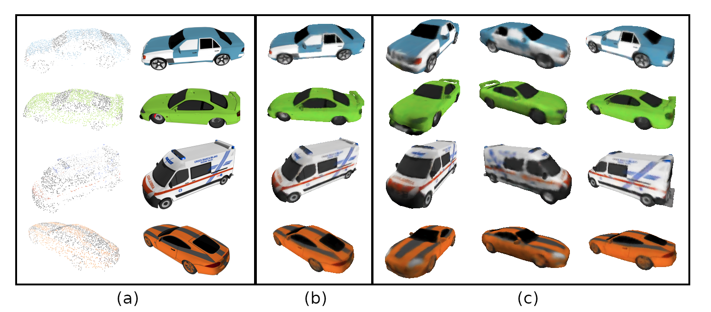

# MFPRN
monocular feature projection & object reconstruction network

# 3D Reconstruction from a Single RGB Image

In this work we train a 3D CNN to predict colored meshes from single view inputs (1 image). The output takes as input camera parameters and an image (a) and predicts a fully colored 3D mesh (c), which we can re-render from the input view to validate our prediction (b). See [full report](https://github.com/AlexSheldrick/MFPRN/blob/main/GR_Alex-Sheldrick_3D-Reconstruction.pdf) for more information.


# 3D Pointcloud reconstruction with image

The network can also use an additional pointcloud as input (a) together with camera parameters and an image (b) to predict an improved fully colored 3D mesh which we can re-render from arbitrary views (c).



The colored mesh generated from a single view looks like this:

https://github.com/AlexSheldrick/MFPRN/assets/59337109/de6237a7-b6af-44ac-ac0d-8921d5afb31f

## Installation
A linux system with cuda 9.0 is required.

Install the dependencies with conda using the `reqs.yml` file :
```
conda env create -f 3d-recon_env.yml
conda activate 3d-recon
```
Clone the repository and navigate into it in the terminal.

Details for data-processing and instructions will follow soon.

## Dataset
In this work, we used the cars subset of [ShapeNet](https://shapenet.org/) dataset.

## References

#### This project uses code from the following projects:
+ [IF-Nets](https://github.com/jchibane/if-net) by [Chibane et. al. 2020] 
+ [Occupancy Networks](https://github.com/autonomousvision/occupancy_networks) by [Mescheder et. al. CVPR'19] 

#### This project is mainly inspired from the following papers:
+ [IF-Nets](https://arxiv.org/abs/2003.01456) by [Chibane et. al. 2020] 
+ [Occupancy Networks](https://github.com/autonomousvision/occupancy_networks) by [Mescheder et. al. CVPR'19] 
+ [PiFU](https://shunsukesaito.github.io/PIFu/) by [Shunsuke Saito et. al. ICCV'19]
+ [DISN](https://github.com/laughtervv/DISN) by [Qiangeng Xu et. al. NeurIPS'19]
